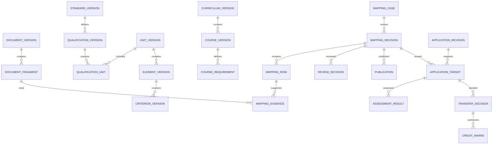

# แบบข้อมูลและสัญญา API ภายใน

เป็น logical design สำหรับพัฒนา migration และ OpenAPI ต่อ ไม่ใช่ฐานข้อมูลหรือ API ที่ติดตั้งแล้ว

## 1. กลุ่มข้อมูล

| Entity | ฟิลด์หลัก/หน้าที่ |
|---|---|
| `organization` | สถานศึกษา/หน่วยงาน ขอบเขตข้อมูลและนโยบาย |
| `user`, `membership`, `role_assignment` | ผู้ใช้ บทบาทองค์กร วันที่มีผล สิทธิ์มอบหมาย |
| `expert_profile`, `expert_appointment` | สาขาความเชี่ยวชาญ หลักฐาน คำสั่งแต่งตั้ง วันหมดอายุ |
| `source_system`, `sync_run`, `source_snapshot` | แหล่งข้อมูล เวลาดึง สถานะ checksum schema และจำนวนที่คาด/รับจริง |
| `document`, `document_version` | เจ้าของ ชนิด ฉบับ วันประกาศ/มีผล ไฟล์ MIME hash สถานะสิทธิ์เผยแพร่ |
| `document_fragment` | document_version, PDF page index, printed page label, heading, bbox, raw text, normalized text, OCR status, reviewed_by |
| `standard`, `standard_version` | identity ตามเจ้าของ/รหัสหรือ external ID; ฉบับและข้อมูล provenance |
| `qualification_version` | standard_version, อาชีพ ระดับ เงื่อนไขคุณสมบัติ และ external qualification ID |
| `unit_version`, `qualification_unit` | UoC และความสัมพันธ์ใช้ในหลายคุณวุฒิ/ระดับ กลุ่มบังคับ/เลือกเมื่อมีหลักฐาน |
| `element_version`, `criterion_version` | EoC, PC, official code ถ้ามี, local ID, parent และลำดับ |
| `standard_requirement` | ความรู้ ทักษะ หลักฐาน ขอบเขต และเงื่อนไขที่โยงกับหน่วย/เกณฑ์และ fragment |
| `curriculum_version`, `department`, `course_version` | ปี ระดับ สาขา รหัสวิชา ชื่อ หน่วยกิตและชั่วโมง พร้อม raw metadata |
| `course_requirement` | ชนิด LO/objective/competency/description/assessment, parent, canonical requirement group, text, fragment |
| `source_reference` | ข้อความอ้างอิงตรง รหัสเต็ม เจ้าของ ระดับ/ฉบับที่ระบุ candidate identity และสถานะการ resolve |
| `mapping_case`, `mapping_revision` | ผู้จัดทำ scope direction sources policy revision status content hash |
| `mapping_target`, `mapping_contribution` | ชุดข้อกำหนดเป้าหมาย และแหล่งหลายข้อที่ร่วมตอบข้อกำหนดนั้น |
| `mapping_row`, `mapping_evidence` | ความสัมพันธ์รายข้อ สถานะ เหตุผล ข้อขาด หลักฐานสองฝั่ง และผลประเมิน |
| `gap`, `remediation_plan` | ข้อกำหนดที่ขาด criticality เหตุผล งานเรียน/ประเมินเพิ่ม ผู้รับผิดชอบ และผลปิด gap |
| `analysis_run`, `candidate_match` | งานเครื่อง model/prompt/config/input/output hash และข้อเสนอที่ไม่มีสิทธิ์รับรอง |
| `review_assignment`, `review_opinion`, `review_decision` | ผู้ตรวจ ขอบเขต ผลประโยชน์ทับซ้อน ความเห็นรายข้อ ผลชี้ขาดและ signature binding |
| `publication` | mapping_revision ที่รับรอง วันที่เผยแพร่/ถอน ผู้เผยแพร่ และสถานะใช้งาน |
| `transfer_application`, `application_revision` | ผู้เรียน สถานศึกษา หลักสูตร คำร้องและฉบับหลักฐานที่ส่ง |
| `credential`, `credential_verification` | เลขคุณวุฒิ เจ้าของ วันออก สถานะ ชุด UoC/ฉบับ ผลตรวจและหลักฐานการตรวจ |
| `application_target`, `assessment`, `assessment_result` | รายวิชาเป้าหมาย mapping ที่ใช้ เครื่องมือ rubric ผู้ประเมิน และผลรายข้อ |
| `transfer_decision`, `credit_award`, `registry_transaction` | ผลคำตัดสินต่อรายวิชา จำนวนหน่วยกิตจริง ผู้อนุมัติ เลขทะเบียน สถานะส่งซ้ำ |
| `appeal` | คำร้องต้นทาง เหตุผล หลักฐานเพิ่ม ผู้วินิจฉัยใหม่ และผลฉบับใหม่ |
| `policy_version` | เอกสารฐานอำนาจ scope วันที่มีผล องค์ประชุม ข้อยกเว้น และเกณฑ์หน่วยกิตที่อนุมัติ |
| `report_artifact` | ประเภทรายงาน revision template version hash ไฟล์ ผู้สร้าง เลขตรวจสอบ และสถานะ |
| `audit_event`, `outbox_event` | การเปลี่ยนก่อน/หลัง actor/time/reason และเหตุการณ์ที่ต้องส่ง worker |

## 2. ความสัมพันธ์หลัก



## 3. ตัวตนและข้อบังคับข้อมูล

- รหัสวิชาไม่ unique ข้ามทุกสาขา ใช้ source + curriculum version + level + department + code และ local UUID ตรวจ crosswalk ก่อนรวมวิชาที่ดูเหมือนซ้ำ
- UoC/EoC ใช้รหัสพร้อม namespace เจ้าของมาตรฐานและฉบับ external ID เป็น identity ของแหล่งนั้น ไม่ใช้รหัสลอย ๆ join ข้ามทุกอาชีพ
- PC ที่ไม่มีรหัสทางการเก็บ `official_code = null`, `local_id`, `source_order`, `text_hash`; ถ้าข้อความหรือโครงสร้างเปลี่ยนให้สร้างฉบับใหม่และ crosswalk ที่ตรวจแล้ว
- แต่ละ citation ต้องเป็นของ document_version เดียวกับ input manifest ของ mapping และมี side = STANDARD/COURSE/LEARNER; ช่วงหน้าต้องอยู่ในไฟล์จริง
- เก็บ exact raw text คู่กับ normalized text; การแก้คำ OCR มีเหตุผลและผู้ตรวจ ไม่ทำให้ hash ไฟล์ต้นฉบับเปลี่ยน
- ไม่มี hard delete สำหรับ revision ที่เคยลงนาม/เผยแพร่/อ้างในคำตัดสิน ใช้ withdrawn/superseded พร้อมเหตุผล
- `analysis_run` เชื่อมข้อเสนอเข้าร่างได้ แต่ foreign key หรือ service ไม่อนุญาตเขียน `review_decision` ในฐานะโมเดล
- Reviewer ลงความเห็นได้เฉพาะ assignment ที่ยังมีผลใน scope นั้น และต้องไม่ใช่ author ของ revision ตามนโยบาย
- ผล `FULL` ที่ยืนยันแล้วต้องมี evidence สองฝั่งและเหตุผลที่ตรวจได้; การรับรองตารางบางส่วนยังต้องระบุข้อที่ unknown ทั้งหมด
- การอนุมัติตรวจ state, revision number, evidence hashes, องค์ประชุม และ policy version ใน transaction เดียว ใช้ optimistic concurrency (`If-Match`) ป้องกันยืนยันฉบับเก่า
- การแก้แถว/หลักฐาน/ขอบเขตหลัง review สร้าง revision ใหม่ ความเห็นเดิมคงอ่านได้แต่ไม่ย้ายเป็นการรับรองฉบับใหม่อัตโนมัติ
- Credit award ใช้ unique key ตามองค์กร/ผู้เรียน/หลักสูตร/รายวิชาเป้าหมาย/ประเภท award ที่นโยบายกำหนด การแก้ไขใช้ reversal หรือ revision ไม่เขียนเพิ่มซ้ำ

## 4. Evidence object ที่เสนอ

```json
{
  "evidenceId": "local-evidence-uuid",
  "side": "COURSE",
  "documentVersionId": "local-document-version-uuid",
  "documentSha256": "actual-sha256-of-source-file",
  "sourceUrl": "https://bsq.vec.go.th/wp-content/uploads/sites/13/2026/03/20101v8.pdf",
  "pdfPageIndex": 56,
  "printedPageLabel": "46",
  "heading": "อ้างอิงมาตรฐาน",
  "quote": "CIP-NPEC-103B",
  "boundingBox": null,
  "verificationStatus": "VISUALLY_VERIFIED",
  "verifiedBy": "actual-reviewer-id",
  "verifiedAt": "actual-review-timestamp"
}
```

นี่เป็น schema example ค่า ID/hash/ผู้ตรวจต้องมาจากฐานข้อมูลจริง ไม่ใช่หลักฐานว่ามีผู้ลงนามแล้ว PDF page index เป็น zero-based ภายใน แต่หน้าจอแสดง “หน้าไฟล์ 57 · หน้าเล่ม 46” ให้ชัด บันทึก bounding box ได้เมื่อวัดจากไฟล์จริง ห้ามคาดเดาตำแหน่ง

## 5. API ภายในที่เสนอ

ใช้ prefix `/api/v1` แยกจาก API เว็บไซต์ต้นทาง ใช้ UUID เป็น route identity พร้อมชื่อ/รหัสสำหรับแสดงผล

| Method/path | หน้าที่ / เงื่อนไข |
|---|---|
| `GET /standards`, `/courses` | ค้นและกรอง version/source/level/department; pagination แบบ cursor |
| `GET /documents/:id/versions/:version` | metadata และ signed download URL ตามสิทธิ์ |
| `POST /documents` | สร้างรายการอัปโหลดร่าง ไฟล์ต้องตรวจผ่านก่อนใช้เป็นหลักฐาน |
| `POST /sync-runs` | ผู้ดูแลข้อมูลสร้างงานนำเข้า คืน 202/jobId |
| `POST /mapping-cases` | สร้าง case และ revision เริ่มต้นพร้อมขอบเขต |
| `PATCH /mapping-cases/:id/revisions/:revision/rows/:row` | แก้ร่างพร้อม If-Match; conflict คืน 409 |
| `POST /mapping-cases/:id/analysis-runs` | เสนอคู่/แถวเบื้องหลังโดยไม่อนุมัติ |
| `POST /mapping-cases/:id/revisions/:revision/submit` | ตรวจหลักฐาน องค์ประชุม และ lock ขอบเขตก่อนเข้า review |
| `POST /review-assignments/:id/opinions` | ผู้ตรวจที่ได้รับมอบหมายแสดงความเห็น |
| `POST /mapping-cases/:id/revisions/:revision/decisions` | ผู้มีอำนาจลงนาม พร้อม revision hash/reason |
| `POST /mapping-cases/:id/revisions/:revision/publications` | เผยแพร่เฉพาะ revision ที่ได้รับอนุมัติและยังใช้งานได้ |
| `POST /transfer-applications` | ผู้เรียน/เจ้าหน้าที่ที่ได้รับสิทธิ์สร้างคำร้อง |
| `POST /transfer-applications/:id/submit` | ผูก application revision และรายการหลักฐาน |
| `POST /transfer-applications/:id/credential-verifications` | บันทึกการตรวจคุณวุฒิ ผู้ตรวจและแหล่งยืนยัน |
| `POST /transfer-applications/:id/assessments` | บันทึกแผน/ผลประเมินตามการมอบหมาย |
| `POST /transfer-applications/:id/decisions` | ใช้ policy และ mapping revision คงที่ผ่าน transaction guard |
| `POST /transfer-applications/:id/registry-transactions` | ส่งผลที่อนุมัติแล้วพร้อม idempotency key |
| `POST /transfer-applications/:id/appeals` | ขอทบทวนโดยเก็บผลเดิม |
| `POST /reports` | ระบุ reportType/entityRevision/templateVersion คืน jobId |
| `GET /reports/:id` | สถานะและไฟล์ตามสิทธิ์ |
| `GET /verify/:publicToken` | ตรวจความแท้/สถานะรายงาน เผยข้อมูลเท่าที่จำเป็น |

error envelope ใช้ `code`, `message_th`, `field_errors`, `request_id` แยก 401/403/404/409/422/429 อย่างสม่ำเสมอ การเผยแพร่/อนุมัติ/ส่งทะเบียนต้องใช้ idempotency key และ audit event ห้ามเชื่อ role หรือ approved ที่ส่งมาจาก client

## 6. การเก็บเวอร์ชันและรายงาน

รายงานที่รับรองต้องตรึง mapping/application revision, document version IDs/hashes, policy version, review decisions และ template version ไม่ generate โดยอ่าน “ข้อมูลล่าสุด” ทุกครั้ง ผู้ใช้ดาวน์โหลดซ้ำได้ไฟล์เดิมหรือ artifact ที่บอกชัดว่าออกใหม่ พร้อม content hash ใหม่

การตรวจ QR ใช้ token ที่เดายาก ระบุเลขรายงาน ชนิด ฉบับ วันออก สถานะปัจจุบันและลายนิ้วมือไฟล์ รายงานบุคคลไม่เผยชื่อเต็ม เลขประจำตัวหรือผลรายละเอียดแก่ผู้ไม่เข้าสู่ระบบ ส่วนการลงลายมือชื่อดิจิทัลจริงเป็นโมดูลแยกจากรูปภาพลายเซ็น/QR และต้องผูกกับผู้ลงนามและไฟล์ที่รับรอง
