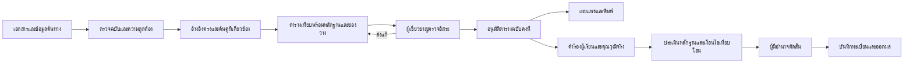
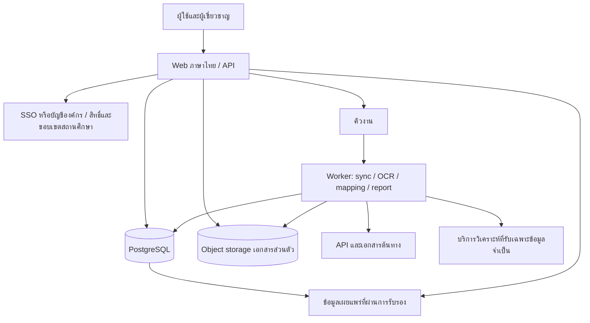

# แบบระบบเทียบเคียงสมรรถนะและพิจารณาเทียบโอน

ฉบับ 1.0 · 11 กันยายน 2569 · ข้อเสนอออกแบบสำหรับนำไปพัฒนา

## 1. ผลลัพธ์ที่ระบบต้องให้

ครูหรือเจ้าหน้าที่เลือกรายวิชาและเห็นมาตรฐานที่หลักสูตรอ้างถึง เปิดเอกสารต้นฉบับพร้อมตำแหน่งข้อความ ตรวจตาราง UoC/EoC/เกณฑ์การปฏิบัติงานกับผลลัพธ์การเรียนรู้และสมรรถนะรายวิชา ส่งให้ผู้เชี่ยวชาญทบทวน และพิมพ์รายงานที่บอกได้ว่าใครรับรองอะไร บนเอกสารฉบับใด

ผู้เรียนยื่นคุณวุฒิวิชาชีพเพื่อขอเทียบโอน เจ้าหน้าที่นำตารางที่รับรองแล้วมาใช้ประกอบการตรวจคุณวุฒิจริง หลักฐานความสามารถ และเงื่อนไขสถานศึกษา ก่อนให้ผู้มีอำนาจอนุมัติและส่งผลให้ทะเบียน

หลักการนี้สอดคล้องกับการตรวจสอบการเรียนรู้ที่เริ่มจากระบุ รวบรวมหลักฐาน ประเมิน และรับรองโดยผู้มีอำนาจตามกรอบ [Cedefop](https://www.cedefop.europa.eu/en/tools/validation-non-formal-informal-learning) การนำมาใช้กับระบบไทยเป็นข้อเสนอออกแบบ ต้องผูกกับระเบียบที่ใช้กับสถานศึกษาและหลักสูตรนั้น

## 2. ขอบเขตและความหมาย

| เรื่อง | การออกแบบ |
|---|---|
| มาตรฐานตั้งต้น | TPQI โดยรักษาเจ้าของมาตรฐาน สาขา อาชีพ ระดับ ฉบับ และวันมีผล |
| รายวิชาตั้งต้น | ปวช./ปวส. หลักสูตร 2567; รองรับหลายปีและหลายสาขาโดยไม่ใช้รหัสวิชาอย่างเดียวเป็นตัวตน |
| รายละเอียดที่เทียบ | UoC → EoC → Performance Criteria รวมความรู้ ทักษะ ขอบเขต เงื่อนไข และหลักฐานการประเมินที่เอกสารกำหนด |
| ฝั่งรายวิชา | ผลลัพธ์การเรียนรู้ จุดประสงค์ สมรรถนะ/มาตรฐานรายวิชา คำอธิบายรายวิชา และเกณฑ์/งานประเมินที่มีเอกสารรองรับ |
| Mapping | ข้อสรุปความสัมพันธ์ระหว่างเนื้อหาและข้อกำหนด ยังไม่ใช่ผลเทียบโอนของบุคคล |
| Credit transfer | คำตัดสินของผู้มีอำนาจต่อผู้เรียนรายบุคคล ตามนโยบายที่ใช้บังคับและหลักฐานของผู้เรียน |
| ทิศทางหลัก | คุณวุฒิหรือชุด UoC ของบุคคล → ข้อกำหนดรายวิชาเป้าหมาย |
| ทิศทางย้อนกลับ | ใช้รายวิชาวางแผนเตรียมความพร้อมสู่ TPQI; ไม่ออกคุณวุฒิ TPQI แทนองค์กรที่มีอำนาจ |

คำว่า “มาตรฐานรายวิชา” และ “สมรรถนะรายวิชา” ต้องรักษาชื่อหัวข้อต้นฉบับ รายการ API ชื่อ `standardName` ไม่ถูกนำมาแทนสองหัวข้อนี้โดยอัตโนมัติ

## 3. ผู้ใช้งานและอำนาจ

| บทบาท | งานหลัก | ขอบเขตอำนาจ |
|---|---|---|
| ผู้เยี่ยมชม | ค้นมาตรฐาน รายวิชา ตารางเผยแพร่ ตรวจเลขรายงาน | เห็นเฉพาะฉบับเผยแพร่ที่ยังใช้งานได้และข้อมูลประวัติที่อนุญาต |
| ผู้เรียน | ยื่นคำร้อง แนบคุณวุฒิ ติดตาม นัดประเมิน รับผล อุทธรณ์ | เห็นคำร้องของตนเอง |
| ครู/ผู้จัดทำ | จัดหลักฐาน สร้างและแก้ mapping เสนอประเมินเพิ่มเติม | ยืนยันร่างของตนเองไม่ได้ |
| ผู้ดูแลข้อมูล | นำเข้าเอกสาร ตรวจ OCR จัดฉบับ แก้ข้อมูลด้วย provenance | เปลี่ยนข้อสรุปที่รับรองแล้วโดยตรงไม่ได้ |
| ผู้เชี่ยวชาญ TPQI | ตรวจมาตรฐาน บริบท ระดับ UoC/EoC/PC | ต้องมีขอบเขตความเชี่ยวชาญและการมอบหมายที่ยังมีผล |
| ผู้เชี่ยวชาญหลักสูตร/วัดผล | ตรวจผลลัพธ์รายวิชา เครื่องมือประเมิน และความเพียงพอ | ทำความเห็นแยกจากผู้จัดทำ |
| ประธาน/ผู้มีอำนาจ | สรุปข้อขัดแย้ง อนุมัติ mapping หรือเทียบโอนตามสิทธิ์ | อำนาจอนุมัติ mapping และคำร้องเป็นคนละ permission |
| งานทะเบียน | ตรวจผลอนุมัติ บันทึกหน่วยกิตและเลขอ้างอิง | ไม่มีสิทธิ์เปลี่ยนหลักฐานหรือความเห็นผู้ประเมิน |
| ผู้ดูแลระบบ | บัญชี การตั้งค่า โครงสร้างพื้นฐาน งานนำเข้า | ไม่ได้สิทธิ์รับรองทางวิชาการโดยปริยาย |
| ผู้ตรวจสอบ | อ่านเวอร์ชัน ประวัติ และรายงานตามการมอบหมาย | อ่านอย่างเดียวและจำกัดข้อมูลส่วนบุคคล |

ข้อเสนอเริ่มต้นให้ผู้ตรวจอิสระสองคน ครอบคลุมมาตรฐานอาชีพและหลักสูตร/การวัดผล พร้อมผู้สรุปเมื่อเห็นต่าง จำนวนและองค์ประชุมตั้งค่าได้ตามคำสั่งแต่งตั้งที่มีเอกสารรองรับ ไม่อ้างว่าเป็นจำนวนที่กฎหมายกำหนด ต้องบันทึกผลประโยชน์ทับซ้อน การถอนตัว และผู้แทน

## 4. โมดูลที่ส่งมอบ

| โมดูล | พฤติกรรมสำคัญ |
|---|---|
| หน้าบ้าน | ค้นแบบรหัส/ชื่อ/ปี/สาขา/ระดับ เปรียบเทียบ เปิดเอกสาร ตรวจสถานะรายงาน |
| พื้นที่ผู้เรียน | แนะนำหลักฐาน ยื่นคำร้อง บันทึกร่าง ดูรายการต้องแก้ ติดตามผล |
| คลังมาตรฐานและรายวิชา | ลำดับชั้น สถานะข้อมูล ฉบับเก่า ความสัมพันธ์ระหว่างฉบับ และประวัติแหล่งที่มา |
| จัดการเอกสาร | รับ PDF/เอกสารหลักสูตร เก็บต้นฉบับ ตรวจไฟล์ OCR จัดหน้า/หัวข้อ และทำเครื่องหมายหลักฐาน |
| โต๊ะทำงาน mapping | เอกสารสองฝั่ง ตารางเทียบ ช่องว่าง เหตุผล และประวัติการแก้ |
| ช่วยค้นและวิเคราะห์ | ค้นจากอ้างอิงตรงก่อน จากนั้นคำศัพท์และความหมาย เสนอแถวพร้อม citation |
| คิวผู้เชี่ยวชาญ | รับมอบหมาย ความเห็นรายข้อ ขอหลักฐาน ส่งแก้ ยืนยัน และวินิจฉัยกรณีเห็นต่าง |
| เทียบโอนรายบุคคล | ตรวจใบรับรอง แฟ้มผลงาน นัดประเมิน ชดเชยช่องว่าง อนุมัติ และส่งทะเบียน |
| รายงาน | สรุป ตารางฉบับเต็ม หลักฐาน การพิจารณา คำตัดสิน และรายการทะเบียน |
| หลังบ้าน | สิทธิ์ คำสั่งแต่งตั้ง นโยบายพร้อมเวอร์ชัน การซิงก์ ตัวชี้วัด และ audit |

## 5. ขั้นตอนและสถานะ

Mapping ใช้ `DRAFT → IN_REVIEW → CHANGES_REQUESTED → IN_REVIEW → APPROVED → PUBLISHED` มี `REJECTED`, `WITHDRAWN`, `SUPERSEDED` และ `REVIEW_REQUIRED` เมื่อหลักฐานเปลี่ยน การกลับจากเห็นต่างไปแก้ไม่ลบความเห็นเดิม

งานเครื่องแยกสถานะ `QUEUED / RUNNING / SUCCEEDED / FAILED / CANCELLED` โดย `SUCCEEDED` หมายถึงสร้างข้อเสนอสำเร็จ ไม่ได้สร้างจำนวนงานรับรองหรือผลอนุมัติ การปิดงานเครื่องไม่มีสิทธิ์เปลี่ยนสถานะ mapping เป็น `APPROVED`

คำร้องใช้ `DRAFT → SUBMITTED → EVIDENCE_CHECK → ASSESSMENT → PANEL_REVIEW → APPROVED / PARTIALLY_APPROVED / REJECTED → REGISTRY_RECORDED` รองรับ `NEEDS_INFORMATION`, `WITHDRAWN`, `APPEALED` และการพิจารณาใหม่ผ่าน revision ผลอนุมัติบางส่วนหมายถึงบางรายวิชาที่อนุมัติ ไม่แปลงเปอร์เซ็นต์ความคล้ายเป็นเศษหน่วยกิตโดยอัตโนมัติ

เมื่อฉบับมาตรฐานเปลี่ยน ระบบค้น dependency ทั้งตาราง รายงาน และคำร้อง เปิดงานตรวจผลกระทบ ระงับการเลือก mapping เดิมสำหรับคำร้องใหม่จนได้รับการวินิจฉัย คำตัดสินเดิมยังคงอยู่พร้อมสถานะประวัติ ผู้มีอำนาจพิจารณาว่ากระทบผลเดิมหรือไม่

## 6. สถาปัตยกรรมที่เสนอ

เริ่มด้วย modular monolith แยก web/API กับ worker เพื่อให้ deploy ดูแลง่ายและทำธุรกรรมรับรองอย่างสอดคล้อง ไม่ต้องแยก microservices ตั้งแต่ต้น

เทคโนโลยีเสนอ: Next.js/TypeScript สำหรับหน้าจอและ API, PostgreSQL สำหรับข้อมูลธุรกรรม, object storage สำหรับไฟล์, Redis/BullMQ สำหรับงานเบื้องหลัง เลือกและล็อกเวอร์ชันที่ยังได้รับการดูแลเมื่อเริ่ม implementation อ้างอิง [Next.js](https://nextjs.org/docs), [PostgreSQL row security](https://www.postgresql.org/docs/current/ddl-rowsecurity.html), [BullMQ](https://docs.bullmq.io/) การเพิ่ม vector index ทำภายหลังได้เมื่อมีชุดทดสอบคุณภาพการค้น

งาน sync, OCR และวิเคราะห์ต้องทำซ้ำได้โดยไม่สร้างข้อมูลซ้ำ มี idempotency key, retry แบบ backoff, checkpoint, dead-letter queue และ cancellation มี transaction outbox สำหรับเหตุการณ์ที่ต้องบันทึกฐานข้อมูลก่อนส่งคิว

## 7. ความมั่นคงและการใช้งานต่อเนื่อง

- บังคับสิทธิ์ทุก request บน server แยกสถานศึกษาและคำร้อง; ทดสอบการเข้าถึงข้ามผู้เรียน ข้ามองค์กร และ export โดยตรง
- MFA สำหรับผู้รับรอง/ผู้ดูแล session timeout และให้ยืนยันตัวตนใหม่ก่อนลงนาม
- เอกสารผู้เรียนอยู่ private storage; ใช้ลิงก์อายุสั้น ตรวจ MIME/ขนาด/มัลแวร์ และป้องกันไฟล์/URL นำเข้าชี้เครือข่ายภายใน
- การอัปโหลดหรือแก้ OCR ไม่แก้ต้นฉบับ เก็บ actor, reason และ diff; การอนุมัติผูก checksum ของ revision และ evidence manifest
- Audit เป็น append-only ภายใต้สิทธิ์เฉพาะ ส่งสำเนาออกไปยัง storage ที่จำกัดการแก้ ไม่อ้างว่า checksum อย่างเดียวป้องกันผู้ดูแลฐานข้อมูลแก้ได้ทั้งหมด
- แยกข้อมูลส่วนบุคคลออกจาก corpus ค้นมาตรฐานและ prompt; กำหนดวัตถุประสงค์ อายุเก็บ ผู้เข้าถึง การลบ และ legal hold ตามนโยบายที่องค์กรรับรอง
- สำรองฐานข้อมูลและเอกสารแบบเข้ารหัส ทดสอบ restore พร้อม checksum; เสนอเป้าหมายเริ่มต้น RPO 24 ชั่วโมง/RTO 4 ชั่วโมงให้เจ้าของระบบยืนยัน
- เมื่อเว็บต้นทางล่ม ใช้ snapshot ล่าสุดที่ผ่านการตรวจและแสดงเวลาข้อมูล; ห้ามสร้างข้อมูลอ้างอิงทดแทนเพื่อให้ workflow เดินต่อ

## 8. ตัวชี้วัด

Dashboard แยกจำนวนรายการนำเข้า ข้อมูลตรวจแล้ว คู่ที่เสนอ ตารางที่มีผู้ตรวจจริง ตารางเผยแพร่ และคำร้องเทียบโอน ห้ามนับข้อเสนอเครื่องเป็นงานผู้เชี่ยวชาญที่เสร็จแล้ว

วัดเวลาเตรียมตาราง เวลา review อัตราความเห็นต่าง จำนวนข้อที่หลักฐานไม่พอ สัดส่วน citation เปิดตรงหน้า อัตราผลคล้ายที่ถูกปฏิเสธ อัตราเอกสารที่ตรวจตรงต้นฉบับ และความสำเร็จการบันทึกทะเบียน รายงานทุกค่าพร้อมขอบเขต/ตัวหาร/เวลาอัปเดต

## 9. ประเด็นนโยบายก่อนเปิดใช้งานจริง

ต้องนำระเบียบเทียบโอนฉบับที่ใช้จริง คำสั่งแต่งตั้งผู้มีอำนาจ เงื่อนไขอายุคุณวุฒิ เพดานหน่วยกิต และรูปแบบผลทะเบียนเข้าเป็น `policy_version` ที่รับรองแล้ว ในการสำรวจครั้งนี้ยังไม่ได้ตรวจยืนยันเอกสารระเบียบครบถ้วน จึงไม่กำหนด 60%, 80% หรือเพดานหน่วยกิตใดเป็นกฎหมาย การพัฒนาคลังข้อมูลและ workflow ทำต่อได้ ส่วนการออกคำตัดสินจริงต้องผูกนโยบายที่มีผลใช้บังคับ
